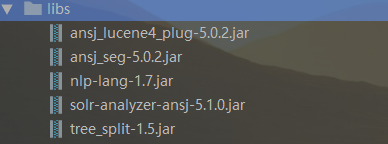

## ansj solr4 plugin

solr版本是4.4的，
原来的索引是windows上，各种jar包引进去后在各个地方都能很好的运行，
但是后面移植到Linux上去后一直找不到一些插件，所以后面重新整理了依赖，
把而且编写了这个新的插件，把这个打包成jar后放入就差不多行了。
依赖都在pom里面。

依赖的包如下图所示：




edit schema.xml:
```

    <analyzer type="index">
         <tokenizer class="org.ansj.solr.AnsjTokenizerFactory"  isQuery="false"/>
    </analyzer>
    <analyzer type="query">
        <tokenizer class="org.ansj.solr.AnsjTokenizerFactory"/>
    </analyzer>
    
```
